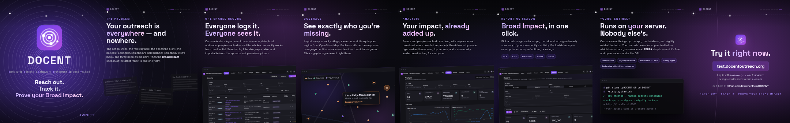

# DOCENT — seamless Instagram carousel

An eight-slide carousel introducing DOCENT, rendered from a **single
8640 × 1350 panorama** so the background, the orbit rings, and the node thread
run straight through the slide edges: swiping reads as one continuous surface
rather than eight separate posters.

All the motion is the app's own — `instagram-carousel.html` links
[`../logo/LogoReveal.css`](../logo/LogoReveal.css) directly and reuses its
classes, so the ripple rings, the radar ping (`dcWave`), the node flashes
(`dcFlash1/2/3`), and the letter rise (`dcRise`) on the cover are literally the
animation that plays on the app's auth screen — the panorama-wide sweep is the
same `dc-wave` element scaled up to 8640 px. Change the animation in the app and
re-render; the carousel follows.



## What's in `out/`

| File | Size | What it is |
|---|---|---|
| `slide-01.png` … `slide-08.png` | 1080 × 1350 | The eight slides, in posting order |
| `slide-01.mp4` | 1080 × 1350, 5 s | The cover as a seamless animated loop (optional, `--video`) |
| `panorama-preview.png` | 2160 × 338 | Quarter-size strip — check the seams here |
| `panorama.png` | 8640 × 1350 | The full surface (git-ignored; re-render to get it) |

## The eight slides

1. **Cover** — the animated mark, wordmark, and *Reach out. Track it. Prove your Broad Impact.*
2. **The problem** — outreach scattered across spreadsheets and inboxes
3. **One shared record** — the events list
4. **Coverage** — gaps vs. reached on the map
5. **Analysis** — the dashboard
6. **Reporting season** — grant-ready exports
7. **Yours, entirely** — self-hosted, backed up, GPL
8. **Try it now** — the test instance and the repo

## Re-rendering

```bash
cd design/social
npm install                 # playwright + a chromium build, and ffmpeg-static for the video
npm run render              # → out/slide-01..08.png + the panorama
npm run render -- --video   # …and the animated cover, out/slide-01.mp4
```

- Already have a browser or ffmpeg? `CHROMIUM_PATH=/path/to/chrome` and
  `FFMPEG_PATH=/path/to/ffmpeg` skip the downloads.
- `instagram-carousel.html` also opens directly in a browser — fonts, styles,
  and screenshots are all local paths, nothing loads from the network.
- Every animation is frozen at one instant (`FREEZE_MS` in `render.mjs`) before
  the slices are cut, so the frame is identical across all eight — that
  consistency is what keeps the seams invisible.

### Editing

Copy lives in the `<section class="slide">` blocks; the ripple geometry, the
node thread, and slide 4's coverage panel are generated by the script at the
bottom of the file. The slides pull their screenshots straight from
`docs/screenshots/`, so re-shoot those (`./scripts/seed-demo.sh`, then capture)
and re-render to refresh the product shots.

> Slide 4 draws its own coverage panel rather than using
> `docs/screenshots/03-map.png`: OpenStreetMap tiles render in the browser, so
> the map comes out blank in a static capture. The pin colours are the app's
> real ones from `frontend/src/components/mapIcons.ts` — amber gap, green
> reached, violet your-venue.

## Posting notes

- Upload **in order, 01 → 08**. Instagram keeps the order you add them in.
- Post at **4:5** (1080 × 1350) and let Instagram use the full portrait frame —
  if it offers a 1:1 crop, decline it, or the seams and the slide furniture get
  cut and the continuity breaks.
- The cover's key lockup sits inside the central square, so the **profile-grid
  thumbnail** still reads even though the grid crops to 1:1.
- To use the animated cover, add `slide-01.mp4` as the first item and
  `slide-02.png` … `slide-08.png` after it. Instagram accepts mixed
  photo/video carousels; the video loops on its own.
- Everything shown is demo data from `./scripts/seed-demo.sh` — no real
  communicators, venues, or events.

## Caption

> Every school visit, festival table, observing night, and podcast your
> community does is Broad Impact — if you can prove it happened.
>
> DOCENT is a free, self-hosted tracker for scientific outreach. Communicators
> log an event once; everyone shares the record, the coverage map, and the live
> dashboard. When the grant report is due, Reports exports the whole thing as a
> PDF, CSV, Markdown, or JSON summary — factual activity only, never private
> notes or ratings.
>
> It runs on your own server with one command, backs itself up nightly, and your
> records never leave your institution.
>
> Swipe through, then try the live demo → test.docentoutreach.org
> Self-host it → github.com/lawrenceleejr/DOCENT
>
> #scicomm #scienceoutreach #physicsoutreach #broaderimpacts #stemoutreach
> #sciencecommunication #openscience #opensource #selfhosted #research
> #universityoutreach #publicengagement

## Licensing

The fonts in `fonts/` (Space Grotesk, Inter) are bundled under the SIL Open Font
License — see the `LICENSE-*.txt` files beside them. Everything else here is part
of DOCENT and covered by the repository's GPLv3 licence.
